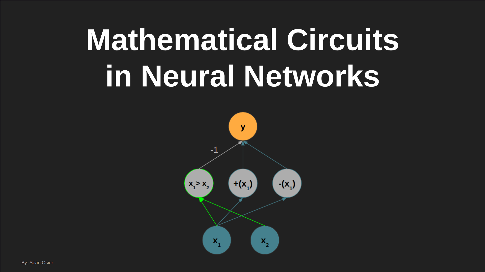

# Mathematical Circuits in Neural Nets

By: Sean Osier

## Summary

In this project, I:

1. Derive by hand the optimal configurations (architecture and weights) of "vanilla" neural networks ([multilayer perceptrons](https://en.wikipedia.org/wiki/Multilayer_perceptron); [ReLU](https://en.wikipedia.org/wiki/Rectifier_(neural_networks)) activations) that implement basic mathematical functions (e.g. absolute value, minimum of two numbers, etc.)

2. Identify "features" and "circuits" of these networks that are reused repeatedly across networks modeling different mathematical functions

3. Verify these theoretical results empirically ([in code](https://github.com/sosier/Mathematical_Circuits_in_Neural_Nets/blob/master/Mathematical_Circuits.ipynb))

What follows is a brief introduction to this work. For full details, please see:
 - [My presentation of this work on YouTube](https://youtu.be/jGQN0TVCtMo) (also linked at the bottom of this page)
 - Or if you prefer to go at your own pace, [the slides](Mathematical_Circuits_in_Neural_Networks.pdf) I walk through in that video

## Motivation

[Olah et al.](https://distill.pub/2020/circuits/zoom-in/) make three claims about the fundamental interpretability of neural networks:

They demonstrate these claims in the context of image models:

***Features / Circuits:***

***Universality:***

This work demonstrate the same concepts apply in the space of neural networks modeling basic mathematical functions.

## Results

Specifically, I show that the optimal network for calculating the minimum of two arbitrary numbers is fully constructed from smaller "features" and "circuits" used across even simpler mathematical functions. Along the way, I explore:
 - "Positiveness" and "Negativeness" Detectors
 - Identity Circuits (i.e. f(x) = x)
 - Negative Identity Circuits (i.e. f(x) = -x)
 - Subtraction Circuits (i.e. f(x1, x2) = x1 - x2)
 - "Greaterness" Detectors
 - And More

***Minimum Network:***

I also demonstrate that each of these theoretical results hold in practice. [The code for these experiments](Mathematical_Circuits.ipynb) can be found in the Jupyter Notebook in this repo. 

## Full Details

For full details, please see the [PDF presenation](Mathematical_Circuits_in_Neural_Networks.pdf) in this repo.

### Watch the Video! (Click image below)

You can watch a full walkthrough of the presentation by clicking the image below:

